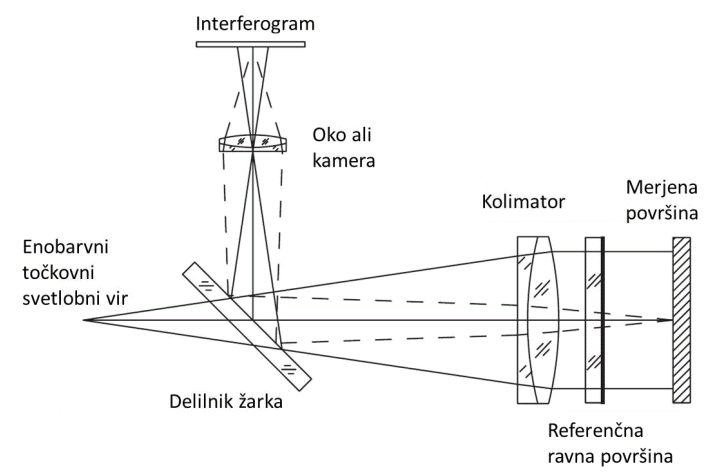

.. _fizeau:

.. |nbsp| unicode:: 0xA0 
   :trim:

Fizeauev interferometer
----------------------------------

Pri tej vaji boste uporabljali polariziran He-Ne laser z valovno dolžino *633 nm* in premerom snopa *0,8* |nbsp| *mm*.

	
	Slika 1. Shema refraktorskega Fizeaujevega interferometra, kjer je kolimator leča.

Praktične naloge:
^^^^^^^^^^^^^^^^^^^^^^^^^^^^^^^^^^

#. Tik za laserski izvor postavite **razširjevalnik snopa**. Prva leča naj ima goriščno razdaljo *7,5 mm*, druga pa *150 mm*. Na ustrezno mesto vstavite **zaslonko** (premera *15 μm*) za prostorsko filtriranje žarka. Drugo lečo postavite na takšno razdaljo, da bo žarek na izhodu kolimiran.
#. Med zaslonko in drugo lečo postavite ploščati delilnik žarka tako, da se bo del žarka odbijal pravokotno na optično os laserja. Pazite da nosilec ne bo zastiral žarka.
#. Izmerite vzporednost prednje in zadnje površine planparalelnih stekel. Meritev izvedite na dveh vzorcih:

	* kvadratno steklo dimenzij *25×25 mm* in
	* okroglo steklo premera cca *40 mm*.

   V ta namen postavite vzorec za kolimator in ga naravnajte pravokotno na optično os žarka. Pogoj za to je, da se odbiti žarki preslikajo nazaj v točkovni izvor - odprtino zaslonke. Interferogram na zaslonu fotografirajte in določite kot nagiba med prednjo in zadnjo površino. Iz fotografije tudi določite morebitna lokalna odstopanja od ravnosti površin! Za izračun boste potrebovali tudi podatek o povečavi interferograma (njegova velikost je namreč odvisna od pozicije zaslona). Zato del kolimiranega žarka tik pred vzorcem zastrite z okroglo palico znanega premera, s čimer boste tudi na interferogramu dobili senco znane širine. Kakšen bo interferogram, če vzorec zavrtite za *90°* okrog optične osi žarka?

#. Izmerite ravnost prednje površine steklene plošče. V ta namen postavite za kolimator referenčno ploščo (okrogla klinasta prizma s kotom *2°*) in jo naravnajte tako, da se bodo žarki z zadnje površine odbili nazaj v odprtino zaslonke. Za referenčno površino dodajte še merjeno ploščo (kvadratno steklo dimenzij *25×25 mm*), ki ji predhodno pobarvajte zadnjo površino. Za to uporabite črn flomaster za pisanje po tabli. Orientirajte jo tako, kot pred tem referenčno površino! Ko bosta obe površini dovolj vzporedni, boste na interferogramu opazili interferenčne proge. S finim pozicioniranjem merjene plošče skušajte na interferogramu dobiti osem do deset prog! Interferogram fotografirajte in določite neravnost površine!
#. Merjeno površino skušajte čim bolj poravnati, tako, da bo na interferogramu vidnih čim manj interferenčnih prog. Interferogram fotografirajte, nato pa kolimacijsko lečo izmaknite tako, da bo pas izhodnega žarka oddaljen približno tri metre. Kakšen je interferogram sedaj? Razložite.
#. Kolimacijsko lečo postavite nazaj na pravo pozicijo. Očistite barvo z zadnje površine vzorca in ga ponovno vstavite v interferometer. Kakšen je interferogram sedaj. Fotografirajte in razložite!
