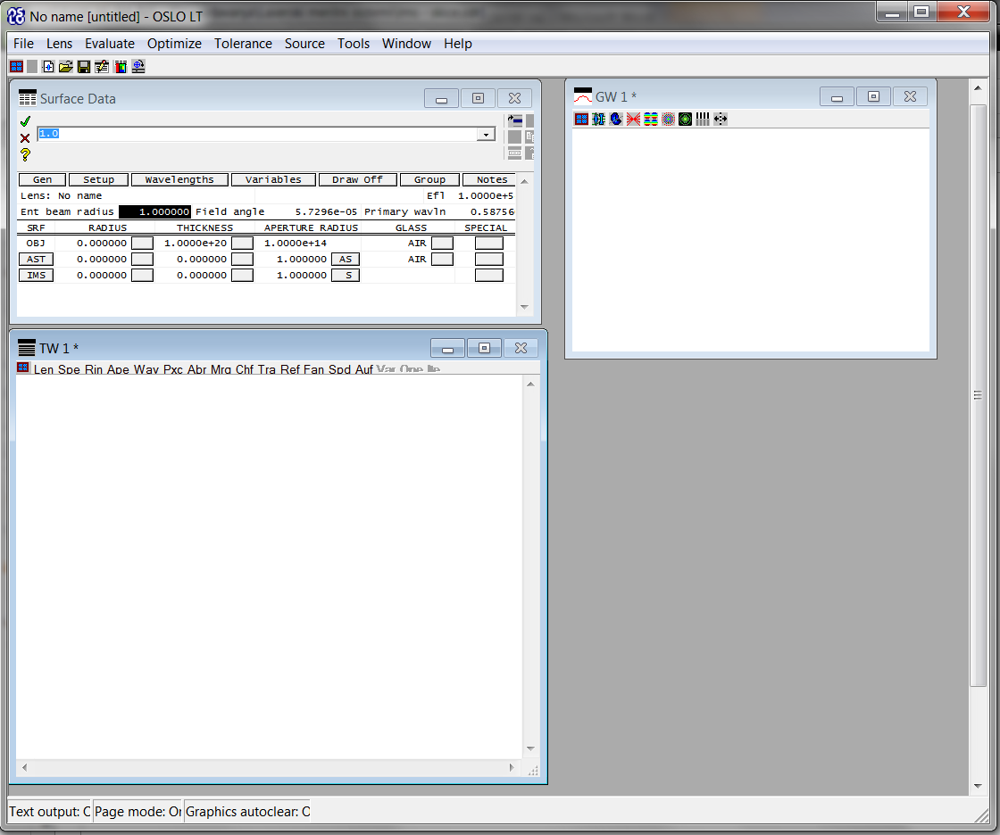

.. _oslo:

.. |Phi| replace:: :math:`{\Phi}'`
.. |n| replace:: :math:`{n}'`

Preračun optičnega sistema s programom OSLO LT
----------------------------------------------------------

Naloge
^^^^^^^^^^^^^^^^^^^^^^^^^^^

#. Zmodelirate optični sistem z dvema lečama.
#. Vizualizirajte optični sistem in izrišite potek žarkovnega stožca skozi optični sistem.
#. Okarakterizirajte kvaliteto preslikave točkovnega svetlobnega izvora.
#. Naredite primerjavo treh tipov leč za primer preslikave iz neskončnosti v končnost.
#. Zmodelirajte razširjevalnik žarka.

Zagon programa
^^^^^^^^^^^^^^^^^^^^^^^^^^^^^^^^^^^^^^^^^^

Ob zagonu izberite:

	

Po potrditvi (*OK*) se v programu pojavijo tri podokna (*Surface Data*, *TW* in *GW*):

	
Zadnji dve služita tekstovnemu (*TW*) in grafičnemu prikazu (*GW*) rezultatov. Okno *Surface Data* je v prvi fazi modeliranja najpomembnejše, saj vanj vnašamo geometrijske in optične podatke proučevanega lečja.

Vnos geometrijskih podatkov
^^^^^^^^^^^^^^^^^^^^^^^^^^^^^^^^^^^^^^^^^^^^^^^^^^^

V oknu *Surface Data* so torej shranjeni podatki optičnega sistema. V tabeli površin so ob pričetku že tri površine in sicer: *objektna površina* (*OBJ*), *zaslonka* (*AST*) in *slikovna ravnina* (*IMS*).

.. image:: images/oslo/3.png
	:alt: reStructuredText, the markup syntax
	:scale: 100 %
	:align: center

Nove površine vnesemo z desnim klikom in ukazom **Insert Before** oziroma **Insert After**. Tako vnesite štiri nove površine med *OBJ* in *AST*. Tabela mora ob koncu imeti sledeč izgled:

.. image:: images/oslo/4.png
	:alt: reStructuredText, the markup syntax
	:scale: 100 %
	:align: center

Določite 3. površino kot zaslonko. To storite z desnim klikom na gumb v stolpcu **APERTURE RADIUS**:

Vnesite razdalje med posameznimi površinami tako, da spremenite vrednosti v stolpcu **THICKENSS**. Razdaljo med objektno ravnino in 1. lečo vnesete v prvo vrstico (*OBJ*). Debelino 1. leče vnesete kot debelino 1. površine. Tako nadaljujete z vsemi debelinami, vključno z debelino 5. površine, ki popisuje razdaljo med zadnjo optično površino in slikovno ravnino.

Vnesite tudi krivinske radije posameznih površin. Zato spremenite vrednosti v stolpcu **RADIUS**.

.. note::
	Pri tem upoštevajte **dogovor o predznaku**: pozitiven, če je center sfere na desni strani površine!

Ob koncu mora imeti tabela sledeč izgled:

Dodajte še materialne podatke in sicer v stolpec **GLASS**. Prva leča je iz stekla z oznako *BK7*, zato v celico 1. površine vpišite *BK7*. Ob tem lahko opazite, da se je na gumbu desno pojavila oznaka **C**, kar pomeni, da je program oznako prepoznal in podatke črpa iz knjižnice o različnih steklih. Enako storimo tudi za drugo lečo, ki je iz stekla *SF11*:

.. image:: images/oslo/7.png
	:alt: reStructuredText, the markup syntax
	:scale: 100 %
	:align: center

Nastavite polmer žarka na vstopu v prvo lečo. Pritisnite na gumb *SETUP* in spremenite parameter **Entr beam rad** na vrednost *7.5*:

Poimenujte optični sistem tako, da v okno *Surface Data*, v polje **Lens** vpišete *LMS – vaja XY*.
	

Vidimo, da tabela poleg stolpcev **RADIUS**, **THICKNESS** in **GLASS** vsebuje tudi stolpca **APERTURE RADIUS** in **SPECIAL**. Prvi stolpec, torej **APERTURE RADIUS**, določa polmer posamezne optične površine, ki se ob privzetem načinu samodejno izračuna glede na polmer žarkovnega stožca. Zato je na gumbih znak **S**, ki pomeni *Solved*. Stolpec **SPECIAL** pa služi za dodatne nastavitve posamezne površine, kot so na primer asferičnost, reflektivnost, ekscentričnost in, kot bomo videli v nadaljevanju, način grafičnega prikaza.

Izris optičnega sistema
^^^^^^^^^^^^^^^^^^^^^^^^^^^^^^^^^^^^^^^^^^^^^^^^^^^

Tako smo vnesli večino geometrijskih in materialnih podatkov. Čas je, da sistem izrišemo in
vizualno preverimo ustreznost podatkov.

V ta namen pritisnemo gumb **Draw Off**, ki se nahaja v oknu *Surface Data*. Po pritisku se gumb preimenuje v **Draw On**, izriše pa se tudi okno *Autodraw*:

.. figure:: images/oslo/10.png
	:alt: reStructuredText, the markup syntax
	:scale: 100 %
	:align: center

V oknu se v osrednjem delu izriše stranski pogled na optični sistem ter centralni in marginalna žarka. V glavi okna (zgoraj) je izpisano ime optičnega sistema ter goriščna razdalja in numerična odprtina slikovnega prostora (*NA*). Pri tem se numerična odprtina izračuna po enačbi:

.. math::
   NA' = n' \cdot sin{\Phi'}

|n| ... lomni količnik medija med zadnjo lečo in slikovno ravnino, |Phi| ... prostorski kot žarkovnega snopa na izhodu iz optičnega sistema

Okno *Autodraw* osveži geometrijo ob vsaki spremembi podatkov, ki so shranjeni v *Surface Data*. Kot vidimo, je privzet način izrisa takšen, da vidimo zgolj stranski pogled leč, brez zaslonke ter objektne in slikovne ravnine.

Manjkajoče optične površine (zaslonko in objektno ter slikovno ravnino) izrišemo tako, da pritisnemo na gumb izbrane površine, v stolpcu **SPECIAL**, in izberemo *Surface Control*:

.. figure:: images/oslo/11.png
	:alt: reStructuredText, the markup syntax
	:scale: 60 %
	:align: center

V oknu *Surface Data* poiščemo polje **Surface appearance in lens drawings** in izberemo možnost *Drawn*:

.. figure:: images/oslo/12.png
	:alt: reStructuredText, the markup syntax
	:scale: 100 %
	:align: center

Isti postopek ponovimo za ostali dve površini. Na koncu mora se mora v *Autodraw* oknu izrisati sledeča slika:

.. figure:: images/oslo/13.png
	:alt: reStructuredText, the markup syntax
	:scale: 100 %
	:align: center

Sedaj vidimo, da se žarki širijo iz objektne točke, ki leži na optični osi, proti optičnemu sistemu, tako da ima snop na vstopu v 1. lečo premer 15 mm. Skozi sistem se žarki lomijo in imajo na izhodu skupno sečišče nekaj milimetrov pred slikovno ravnino. To sečišče ne sovpada s slikovno ravnino, ker smo njeno lego izračunali na osnovi paraksialne aproksimacije, marginalna žarka pa oklepata že relativno velik kot z optično osjo.

Nastavimo izris tako, da bomo poleg omenjenih treh žarkov videli še štiri vmesne. Izberemo meni *Lens->Lens drawing Conditions...* Nato v oknu *Surface Data* nastavimo število objektnih točk (**Nuber of field points for ray fans**), iz katerih se širijo žarkovni snopi na *1*. Naš optični sistem uporabljamo zgolj za preslikavo točkovnega svetlobnega izvora, ki leži na optični osi, zato je ena objektna dovolj. Nato pa v polju pod **Rays** vnesemo željeno število izrisanih žarkov, torej *7*:

Spremenljivki **Min pupil** in **Max Pupil** določata relativno višino zgornjega in spodnjega žarka na vstopni odprtini in sicer glede na njen polmer. Po potrditvi sprememb se mora v Autodraw oknu izrisati sledeča slika:

.. figure:: images/oslo/15.png
	:alt: reStructuredText, the markup syntax
	:scale: 100 %
	:align: center

Vidimo, da se žarki, ki so blizu optične osi, dejansko sekajo na slikovni ravnini, tisti bolj oddaljeni pa se zaradi sferične aberacije sekajo bližje sistemu.

Karakterizacija preslikave točkovnega svetlobnega izvora
^^^^^^^^^^^^^^^^^^^^^^^^^^^^^^^^^^^^^^^^^^^^^^^^^^^^^^^^^^^^^^^^^^^^^^^^^^^^^^^^^^^^^^^^^^^^^^^^^^^^^^

Oddaljenost med sečiščema opazovanega in glavnega žarka s slikovno ravnino se spreminja v odvisnosti od višine opazovanega žarka na vstopni odprtini. To odvisnost lahko prikažemo grafično s tako imenovano žarkovno presečno krivuljo (*angl.: ray intercept curve*), kjer abscisna os predstavlja relativno višino žarka na vstopni odprtini (imenovana *FX* oziroma *FY*), ordinatna os pa oddaljenost (*DX* oziroma *DY*).

Spodnja slika prikazuje primer treh žarkovnih presečnih krivulj, ki pripadajo trem legam slikovne ravnine. Vidimo, da se s spreminjanjem lege slikovne ravnine spreminja naklon presečne krivulje, ne pa tudi njena ukrivljenost. Krivulja b predstavlja potek oddaljenosti, kadar je slikovna ravnina na mestu paraksialnega nastanka slike. V tem primeru sekajo žarki, ki imajo na izhodu iz leče pozitivno višino, pod glavnim žarkom (zato ima krivulja negativno vrednost).

Žarki, ki izhajajo iz spodnje strani leče, pa sekajo slikovno ravnino nad glavnim žarkom.

.. figure:: images/oslo/16.png
	:alt: reStructuredText, the markup syntax
	:scale: 100 %
	:align: center

V programu *OSLO LT* izrišemo žarkovno presečno krivuljo v oknu *UW 1* (za grafični prikaz) tako, da izberemo **Ray Analysis** v meniju **Setup Window** (skrajno levi gumb, zgoraj). Nato pa izberemo **RIC Plot**. V oknu se nam izriše sledeč diagram:

.. figure:: images/oslo/17.png
	:alt: reStructuredText, the markup syntax
	:scale: 100 %
	:align: center

Dejansko sta prikazana dva diagrama: *DY(FX)* in *DX(FX)*, ki pa se za primer osno postavljene objektne točke medsebojno ne razlikujeta. Poleg tega so na vsakem diagramu tri krivulje, ki predstavljajo žarkovna presečišča za različne valovne dolžine: *modra* barva za modro svetlobo, *zelena* za zeleno in *rdeča* za rdečo barvo svetlobe. Natančne vrednosti valovnih dolžin posamezne barve lahko spreminjate v oknu *Surface Data* s klikom na gumb **Wavelengths**.

Iz diagrama vidimo, da se s povečevanjem vstopnega premera žarkovnega snopa vedno hitreje (po kubični odvisnosti) povečuje tudi razdalja DY oziroma DX. Maksimalna vrednost znaša približno 1 mm.

Takšen način prikazovanja optične napake je zelo učinkovit, saj lahko enostavno vidimo kakšen je še sprejemljiva velikost vstopne odprtine oziroma zaslonke.

Primerjava treh tipov leč pri preslikavi iz neskončnosti v končnost
^^^^^^^^^^^^^^^^^^^^^^^^^^^^^^^^^^^^^^^^^^^^^^^^^^^^^^^^^^^^^^^^^^^^^^^^^^^^^^^^^^^^^^^^^^^^^^^^^^^^^^

Primerjajte **bikonveksno**, **plankonveksno** in **»Best-Form«** lečo za primer preslikave iz neskončnosti v končnost. *Plankonveksna* in *»Best-Form«* leča naj bosta obrnjeni *prav* in *narobe*.

1. Podatke o lečah poiščite na `spletu <https://www.thorlabs.com/navigation.cfm?guide_id=13>`_. Uporabite leče brez antirefleksnega nanosa, z goriščno razdaljo **50 mm** in premerom **1 inčo**. Material leče naj bo **BK7**.
2. V leče naj vstopata svetlobna snopa s polmeroma **2 mm** in **10 mm**.
3. Primerjajte radije preslikane točke v:

 - gorišči točki, kot jo navaja dokumentacija leče (*BFL*)
 - v paraksialnem gorišču
 - na mestu najmanjše točke (**autofocus – minimal RMS spot size**).
