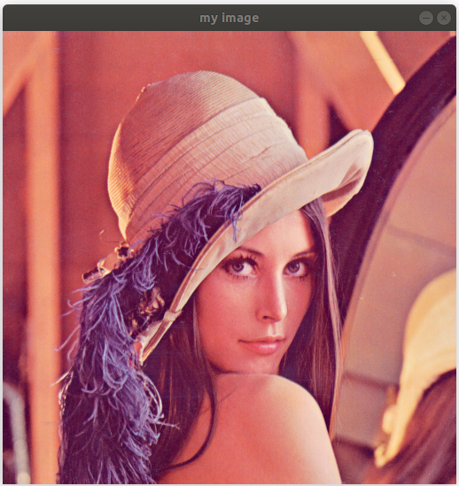
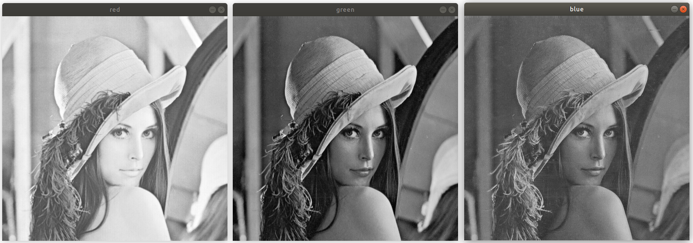
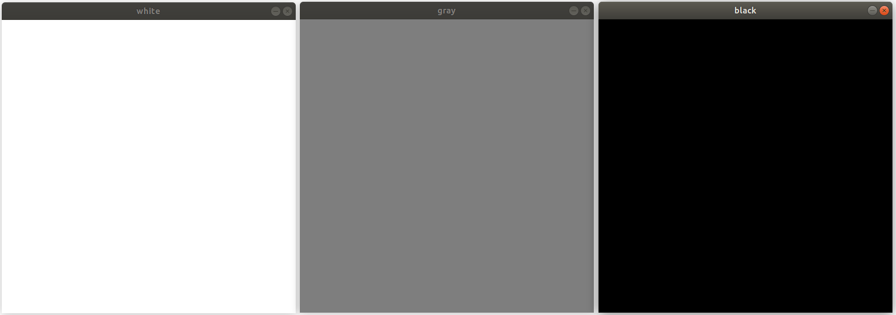
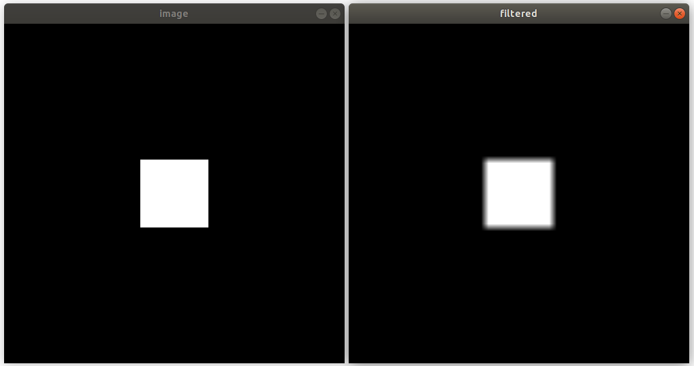
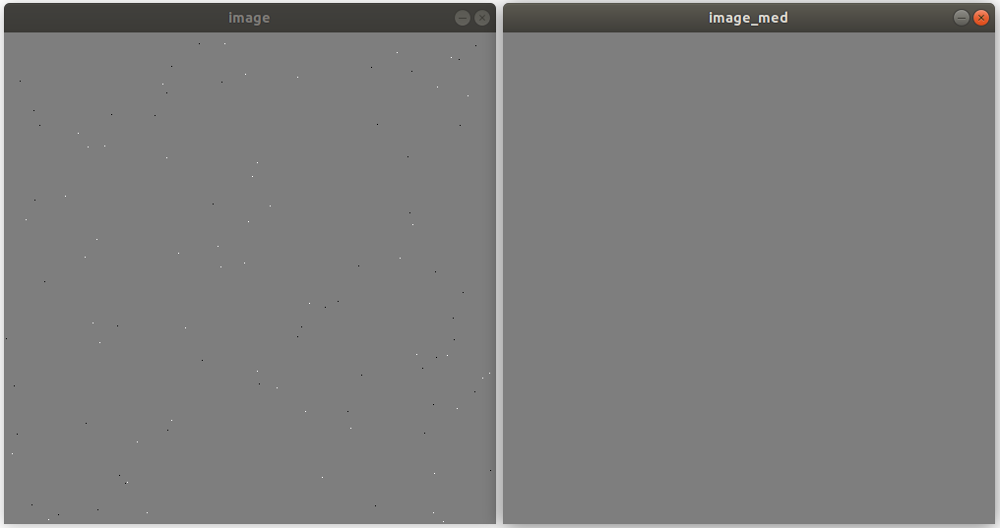

.. _uvod_py_opencv:

Uvod v računalniško obdelavo slik
--------------------------------------------

.. note::
   Če še nimate nameščenega *Python*-a in *OpenCV*-ja sledite navodilom na povezavi: :ref:`navodila_python`.

Na tej vaji se boste spoznali z osnovnimi koncepti računalniške obdelave slik, programskim jezikom *Python* (predpostavljamo, da ste osnovno znanje že osvojili pri predmetu `Programiranje in numerične metode v ekosistemu Pythona <https://jankoslavic.github.io/pypinm.io/>`_) in predvsem s programsko knjižnico *OpenCV*.

Uvod
^^^^^^^^

**OpenCV** (*Open Source Computer Vision Library*) je knjižnica programskih funkcij, ki je v osnovi namenjena procesiranju slik v realnem času. Gre za cross-platform knjižnjico in je `prosta za uporabo <https://en.wikipedia.org/wiki/Apache_License>`_. Prav v tem leži ena njenih največjih prednosti, saj jo lahko uporabljamo v različnih programskih jezikih (`C++ <https://en.wikipedia.org/wiki/C%2B%2B>`_, `Python <https://en.wikipedia.org/wiki/C%2B%2B>`_, `Java <https://en.wikipedia.org/wiki/Java_(programming_language)>`_, `MATLAB <https://en.wikipedia.org/wiki/MATLAB>`_) in v različnih operacijskih sistemih (`Windows <https://en.wikipedia.org/wiki/Microsoft_Windows>`_, `Linux <https://en.wikipedia.org/wiki/Linux>`_, `macOS <https://en.wikipedia.org/wiki/MacOS>`_, `Android <https://en.wikipedia.org/wiki/Android_(operating_system)>`_, `iOS <https://en.wikipedia.org/wiki/IOS>`_).

Na današnji vaji bomo spoznali osnovno fukcionalnost, trike in pasti.

.. note::
   Kot velikokrat v življenju, tudi v programiraju velja, da do končnega cilja ne vodi le ena (pravilna) pot, ampak je le-teh (skorajda *neskončno*) mnogo. Različne poti se lahko bolj ali manj primerne, boli ali manj upoštavajo različne konvencije ipd... Pri predmetu LMS se bomo poskušali čim bolj držati pravil, ki ste jih spoznali pri predmetu `Programiranje in numerične metode v ekosistemu Pythona <https://jankoslavic.github.io/pypinm.io/>`_); včasih najbrž neuspešno. Koda, ki jo bomo pisali bo daleč od optimalne Python kode, ampak bo zelo *skriptna* in čim bolj podobna `pseudo kodi <https://en.wikipedia.org/wiki/Pseudocode>`_. 

Vaja 1: branje in pisanje slik z diska
=============================================

Napišimo za začetek enostaven *Python* skripto, ki bo z diska prebrala sliko in jo prikazala.

.. literalinclude:: images/uvod_v_py/vaja1.py
	:language: python
	:linenos:

Če pogedamo sedaj vrstico po vrstico.

.. literalinclude:: images/uvod_v_py/vaja1.py
	:language: python
	:lines: 1

V prvi vrstici vljučimo *OpenCV*.

.. literalinclude:: images/uvod_v_py/vaja1.py
	:language: python
	:lines: 3

V vrstici *3* preberemo sliko z diska s klicom ``cv2.imread()``. ``cv.`` pomeni, da bomo sedaj klicali funkcijo iz knjičnice, ``imread`` pa je ime funkcije. Vidite lahko, da funkcija sprejme samo en argument. Ta je tipa string in opisuje pot na disku do slike.

.. note::
	Ta navodila so pisana v *OS* *Ubuntu/Linux*. Zato so vse poti napisane v Linux "stilu". Če uporabaljte *OS* *Windows*, je zadeva nekoliko bolj zapletena. Za opisovanje poti imate nekako 3 možnosti. Recimo, da je vaša slika na lokaciji ``"C:\SomeFolder\SomeOtherFolder\my_image.jpg"``.
	
	1. pot podate z dvojno levo poševnico (*backslash*-om), torej: ``"C:'\\SomeFolder\\SomeOtherFolder\\my_image.jpg"``
	2. pot podate s poševnico (*slash*-om), torej: ``"C:/SomeFolder/SomeOtherFolder/my_image.jpg"``
	3. pot podate kot *dobeseden string* (*literal string*), torej: ``r"C:\SomeFolder\SomeOtherFolder\my_image.jpg"``
	
	Težava je v tem, da če pot kopirate, bodo v imenu leve poševnice, ti pa so rezervisani za *posebne znake* (*special characters*, npr. ``"\n"`` pomeni novo vrstico, ``"\t"`` pomeni *tab*, ``"\s"`` presledek itd...).
	Python ne loči med ``"`` in ``'``, torej lahko uporabljete kateregakoli, morata pa biti **v paru enaka znaka**.
	
.. warning::
	Ne glede na operacijski sistem pa **morate podati celotno pot; torej od diska do končnice!** Izjema so t.i. *relativne poti*.
	
.. literalinclude:: images/uvod_v_py/vaja1.py
	:language: python
	:lines: 4

V četrti vrstici sliko prikažemo s klicom funkcije ``cv2.imshow()``. Funkcija ima 2 parametra: prvi je ime okna (glej *sliko 1*), z drugim pa podamo sliko/matriko, ki jo želimo izrisati.

	
	Slika 1. Prikazana slika.

.. note:: 
	Slike so v računalništvu matrike. Če ima slika *640x480* (*širina* x *višina*) pikslov, imamo torej matriko *480x640* (pazite, pri matrikah **najprej podamo štelivo vrstic, potem število stolpcev!**) kjer vrednost vsakega elementa popoisuje intenziteto posameznega piksla (v primeru sivinske - *grayscale* slike). Če imamo opravka z barvno sliko (npr. *RGB* barvni model) imamo 3 matrike, po eno za posamezen kanal (barvo).

.. literalinclude:: images/uvod_v_py/vaja1.py
	:language: python
	:lines: 5
	
V peti vrstici s fukcijo ``cv2.waitKey()`` čakamo na pritisk katerikoli tipke. 
Če pogledamo v `dokumentacijo <https://docs.opencv.org/4.0.0/d7/dfc/group__highgui.html#ga5628525ad33f52eab17feebcfba38bd7>`_ fukcije, je tam zapisamo ``retval = cv.waitKey([, delay] )``. Branje in razumevanje dokumentacije je ena najpomembnejših vrlin, ki jo kot programerji moramo osvojiti. Poglejmo, kaj lahko iz tega razberemo. Znotaj ``()`` vidimo ``[, delay]``. To pomeni, da fukcija sprejme 1 argument, ki pa je opcijski (to povesta ``[]``): to pomeni, da ga lahko podamo, ni pa nujno. Če nadalnje preberemo dokumentacijo piše: *"The function waitKey waits for a key event infinitely (when delay≤0 ) or for delay milliseconds, when it is positive."*. Torej, če argumenta ``delay`` ne podamo, bo funkcija čakala na pritist tipke "v neskončnost", če pa jo, bo počakala samo število milisekund, kot smo ga podali s parametrom ``delay``.
Vidimo lahko tudi, da fukcija vrne ``retval``. V dokumentacij piše: *"It returns the code of the pressed key or -1 if no key was pressed before the specified time had elapsed."*. Ugotovimo lahko, katero tipko smo pritisni (vrne **ASCII** kodo, najdete jo lahko v stolpcu **Dec** v `tabeli <https://en.wikipedia.org/wiki/ASCII#Printable_characters>`_, ali s *Python* klicom ``ord('<vaša črka>')``).

Po 5. vrstici bi se torej izvajanje programa moralo ustaviti in prikazati sliko. Ko pritisnemo tipko ze izvajanje skripte nadaljuje z zadnjo vrstico, kjer vsa odprta okna zapremo.

.. note::
	Če ne kličemo funkcije ``cv2.destroyAllWindows()`` običajno okno ostane odprto in neodzivno (ne moremo ga zapreti), kar je lahko moteče.

Kot lahko vidimo, je prikazana slika barvna, torej jo sestavljajo 3 kanali, rdeč, zelen in model. Dopolnimo skripto tako, da sliko razdelimo na posamezne kanale, jih prikažemo, premešamo in sliko spet shranimo.

.. literalinclude:: code/uvod_v_py/vaja1a.py
	:language: python
	:linenos:

Dodali smo vrstice *5-10*, *12* in *15*.

	
.. note::
	Čeprav običajo slišite "RGB", *OpenCV* uporablja zaporedje **blue, green, red**.
	
	
.. figure:: images/uvod_v_py/images/Lenna+merged.png
	:alt: reStructuredText, the markup syntax
	:align: center
	
	Slika 2. Originalna *Lenna* in *Lenna* s premešanimi kanali.

	
	Slika 3. Posamezni kanali.
	
	
Vaja 2: zajemanje in prikazovanje slike s kamere
=======================================================================

V tem delu vaje bomo pogledali, kako s pomočjo *OpenCV*-ja zajamemo sliko s kamere, ki je priklopljena na računalnik.

.. literalinclude:: images/uvod_v_py/vaja2.py
	:language: python
	:linenos:
	
Skripta je sedaj nekoliko daljša.

.. literalinclude:: images/uvod_v_py/vaja2.py
	:language: python
	:lines: 3

Najpomembnejša razlika v primerjavi s prejšnjo skripto je vrstica *3*. ``VideoCapture`` je `razred <https://en.wikipedia.org/wiki/Class_(computer_programming)>`_ za zajem videa iz različnih video datotek, sekvenc slik in *hardware*-a - kamer. Če podrobneje pogledamo `dokumentacij <https://docs.opencv.org/3.4/d8/dfe/classcv_1_1VideoCapture.html#details>`_ omenjenega razreda lahko vidimo, da imamo na voljo 5 razlčnih `konstruktorjev <https://en.wikipedia.org/wiki/Constructor_(object-oriented_programming)>`_ :

1. ``<VideoCapture object> = cv.VideoCapture( )`` ... *default* konstruktor, za enkrat za nas ni zanimiv
2. ``<VideoCapture object> = cv.VideoCapture( filename )`` ... "odpremo" video datototeko
3. ``<VideoCapture object> = cv.VideoCapture( filename, apiPreference	)`` ... "odpremo" video datototeko in določimo s katero *video* knjižnico
4. ``<VideoCapture object> = cv.VideoCapture( index )`` ... "odpremo" kamero
5. ``<VideoCapture object> = cv.VideoCapture( index, apiPreference )`` ... "odpremo" kamero in določimo s katero *video* knjižnico

.. warning::
	Kadarkoli "odpremo" nek kos *hardware*-a, ga moramo potem tudi zapreti (glejte vrstico *20*). Če tega ne storimo, v ob naslednjem poskusu odpiranja to ne bo mogoče, saj je npr. kamera že odprta. Tudi v dokumentaciji piše: *In C API, when you finished working with video, release CvCapture structure with cvReleaseCapture()...*
	
.. note::
	Dokumentacija *OpenCV*-ja je primarno napisana za *C++*; za *Python* je precej skopa in moramo velikokrat prebrati kaj piše za *C++* in to "preversti" v *Python*.
	
V vrstici *3* lahko vidite, da smo uporabiti opcijo *4*. ``index`` je tipa ``int`` in določa, katero kamero želimo odpreti.

.. note::
	*Python* tako kot vsak resen programski jezik začenja šteti z **0** in ne z **1** (*I'm looking at you, MATLAB!*); torej, *index prvega elementa* je *0*!
	

Klic nam vrne `objekt <https://en.wikipedia.org/wiki/Object_(computer_science)>`_ tipa *VideoCapture*, ki ga "ujamemo" v spremenljivo ``cam``. V vrstivi 6 začnemo neskončno **while** zanko.

.. literalinclude:: images/uvod_v_py/vaja2.py
	:language: python
	:lines: 7
	
V vrstici *7* kličemo metodo razreda *VideoCapture* ``read()``. V dokumentaciji lahko preberemo, da metoda *Grabs, decodes and returns the next video frame.*. Sintaksa je zapisana kot ``retval, image = cv.VideoCapture.read( [, image] )``. Spet lahko vidimo, da sprejme en opcijski parameter ``image``, ki pa ga lahko "ujamemo" tudi na izhodnji strani. Glede ``retval`` pa piše *false if no frames has been grabbed*. Tako v vrsticah *8-9* preverim, ali je branje uspelo in če ni *neskončno* zanko zaključimo.

V vrstici *10* preverimo, kakšno je treutno stanje spremenljivke ``flip`` in eventuelno izvedemo vrstico *11*. **Vaša naloga je**, da na spletu poiščete dokumentacijo *OpenCV* funkcije ``cv2.flip()`` in **ugotovite**, kaj funkcija naredi in kaj sta oba parametra.

.. literalinclude:: images/uvod_v_py/vaja2.py
	:language: python
	:lines: 14-17

V vrsticah *14-17* imamo 2 klica povezana s tipko, ki smo jo (eventuelno) pritisnili v vrstici *13*. *27* je koda tipke *ESC* in v tem primeru zanko zaključimo, če pa pritisnemo tipko *f* spremenimo *True/False* stanje spremenljivke ``flip``.

Vaja 3: globina slike (*image depth*) in prikazovanje slike
==========================================================================

Če uporabljate *Jupyter Notebook*, spremenljivke ostanejo v spominu tudi, ko se izvajanje skripte konča. V naslednjo celico napišite klic:

.. code-block:: python
	
	print(type(frame[0, 0, 0]))
	output: <class 'numpy.uint8'>
   
Slika v spremenljivki ``frame`` je v resnici trodimenzionalna matrika, vredsnoti znotraj oglatih oklepajev pa koordinata piksla, ki ga želimo izpisati: *prva* vrednost določa vrstico, *druga* stolpec in *tretja* kanal, če imamo RGB sliko. Če je slika sivinska moramo podati samo 2 vrednosti. Vidimo lahko, da je element tipa ``uint8``. To pomeni, da je *unsigned integer* (celo število brez predznaka) popisan z osmimi biti. Najmanjša vrednost, ki jo torej lahko opišemo je torej '0' (binarno *0000 0000*, hex *00*), največja pa *255* (binarno *1111 1111*, hex *ff*). **Vprašanje:** kaj se zgodi, če *uint8* spemelnjivki z vrednostjo *255* prištejemo *1*?

Napišimo kratko skripto, ki bo izrisala 3 slike: črno, sivo in belo.

.. literalinclude:: images/uvod_v_py/vaja3.py
	:language: python
	:linenos:
	
Kot lahko vidite, smo sedaj uvozili še eno knjižnico, `numpy <https://numpy.org/>`_ (vrstica *1*). Gre za "*The fundamental package for scientific computing with Python*". Ker je njeno ime dolgo, ga okrajšamo, tako da jo lahko kličemo kot ``np.``.
V vrstici *4* določimo dmenzije slik. V vrsticah *6-8*, naredimo najprej 3 matrike enic, ki jih potem pomnožimo z *0* za črno sliko, *126* za sivo in *255* za belo. Ko slike izrišemo, vidimo nekaj takega:

	
	Slika 4. Bela, siva in črna generirana slika.
	
V vrsticah *6-8* smo nastavili, da je posamezen element matrik tipa ``uint8``. To imenujemo **image depth** (v prostem prevodu *"globina"* *slike*). Spremenimo sedaj *globino* naših slik v ``float32``, torej število s plavajočo vejico in 32 biti, in skripto ponovno poženimo.

.. figure:: images/uvod_v_py/images/w_s_b_f32.png
	:alt: reStructuredText, the markup syntax
	:scale: 40 %
	:align: center
	
	Slika 5. Enake 3 slike kot na *sliki 4*, le da so sedaj v formatu *float32*.

Opazimo lahko, da sta sedaj tako slika *gray* kot slika *white* beli. Zakaj?

.. note::
	**Zapomnite si:** če z *OpenCV* funkcijo ``imshow()`` izrisujemo slike *globine* **integer**, bo **0 ... črna**, **255 ... bela**, če pa izrisujemo slike *globine* **float**, bo **0.0 ... črna**, **1.0 ... bela**!
	
Vaja 4: filtriranje slik
=============================================

Pri procesiranju slik se pogosto poslužujemo različnih filtriranj. Filtriranje običajno temelji na principu `konvolucije <https://towardsdatascience.com/intuitively-understanding-convolutions-for-deep-learning-1f6f42faee1>`_. V *OpenCV*-ju imamo na voljo različne predefinirane filtre, lahko pa ga ustvarimo sami. Karakteristike filtra določa njegovo *jedro* (*angl. kernel*). Poglejmo si primer enega najbolj uporablajnih filtrov - *Gaussov filter*.

.. literalinclude:: images/uvod_v_py/vaja4.py
	:language: python
	:linenos:
	
.. code-block:: python

	kernel:
	 [[0.17820325]
	 [0.21052228]
	 [0.22254895]
	 [0.21052228]
	 [0.17820325]]
	
	difference:
	 0.0

V vrstici *7* uporabimo predefiniran *Gaussov* filter v funkciji ``GaussianBlur``. Medtem v vrstici 9 generiramo eno-dimenzionalen Gaussov filter z enakimi parametri, potem pa ga uporabimo v ``sepFilter2D``. Tej funkciji podamo posebej tilter v *X* in *Y* smeri. V *output* oknu lahko vidimo izpisa; vrednosti *kernela* in pa razliko med obema slikama, ki nam potrdi, da smo v obeh primerih sliko enako sfiltrirali. 

Naredimo sedaj lasten *Moving Average* filter.

.. literalinclude:: images/uvod_v_py/vaja4a.py
	:language: python
	:linenos:
	
.. code-block:: python

	[[0.00826446 0.00826446 0.00826446 0.00826446 0.00826446 0.00826446 0.00826446 0.00826446 0.00826446 0.00826446 0.00826446]
	 [0.00826446 0.00826446 0.00826446 0.00826446 0.00826446 0.00826446 0.00826446 0.00826446 0.00826446 0.00826446 0.00826446]
	 [0.00826446 0.00826446 0.00826446 0.00826446 0.00826446 0.00826446 0.00826446 0.00826446 0.00826446 0.00826446 0.00826446]
	 [0.00826446 0.00826446 0.00826446 0.00826446 0.00826446 0.00826446 0.00826446 0.00826446 0.00826446 0.00826446 0.00826446]
	 [0.00826446 0.00826446 0.00826446 0.00826446 0.00826446 0.00826446 0.00826446 0.00826446 0.00826446 0.00826446 0.00826446]
	 [0.00826446 0.00826446 0.00826446 0.00826446 0.00826446 0.00826446 0.00826446 0.00826446 0.00826446 0.00826446 0.00826446]
	 [0.00826446 0.00826446 0.00826446 0.00826446 0.00826446 0.00826446 0.00826446 0.00826446 0.00826446 0.00826446 0.00826446]
	 [0.00826446 0.00826446 0.00826446 0.00826446 0.00826446 0.00826446 0.00826446 0.00826446 0.00826446 0.00826446 0.00826446]
	 [0.00826446 0.00826446 0.00826446 0.00826446 0.00826446 0.00826446 0.00826446 0.00826446 0.00826446 0.00826446 0.00826446]
	 [0.00826446 0.00826446 0.00826446 0.00826446 0.00826446 0.00826446 0.00826446 0.00826446 0.00826446 0.00826446 0.00826446]
	 [0.00826446 0.00826446 0.00826446 0.00826446 0.00826446 0.00826446 0.00826446 0.00826446 0.00826446 0.00826446 0.00826446]]

V vrsticah *7* in *8* generiamo *11x11* matriko enic in jo v normaliziramo (vsota vseh uteži mora biti *1.0*). Na *sliki 6* sta prikazani izvorna in filtrirana slika. 

	
	Slika 6. Izvorna in filtrirana slika.
	
Median filter
^^^^^^^^^^^^^^^^^^^^^^^^^^^^^^^

*Median* filter je filter, kjer aktivnemu pikslu pripišemo vrednost mediane znotraj konvolucijskega okna. Gre za filter, s katerim lahko odstranimo npr. termičen šum.

.. literalinclude:: images/uvod_v_py/vaja4med.py
	:language: python
	:linenos:
	

	
	Slika 7. Izvorna in filtrirana slika z *median* filtrom.
	
Vaja 5: *kopiranje* slik
=============================================