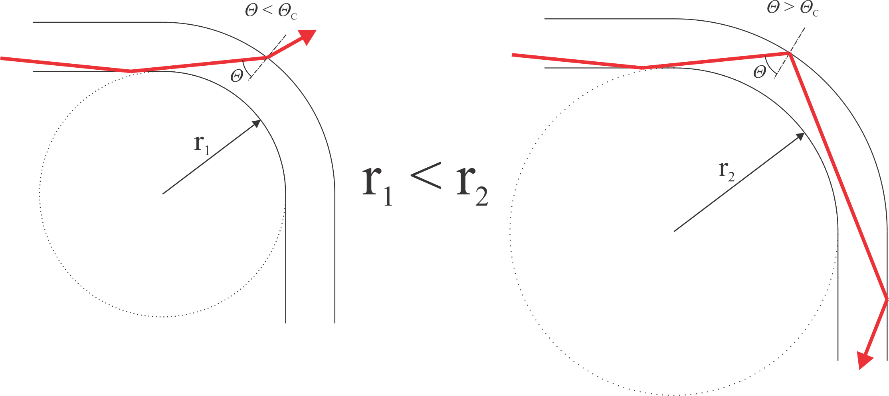
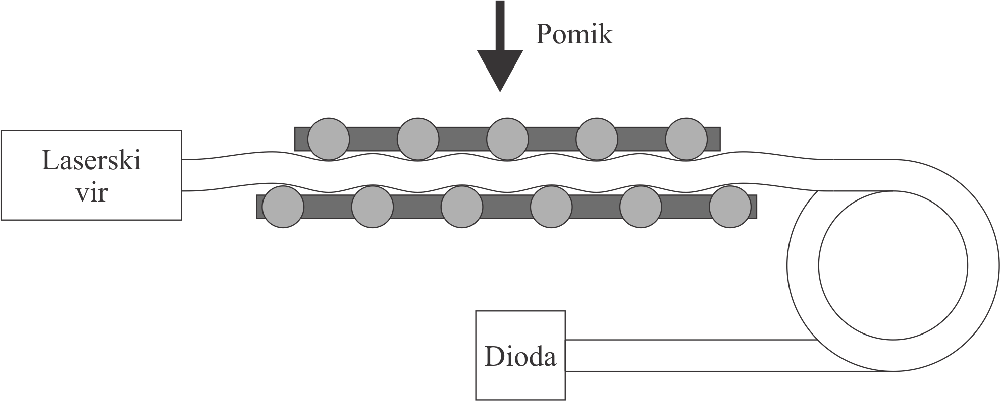
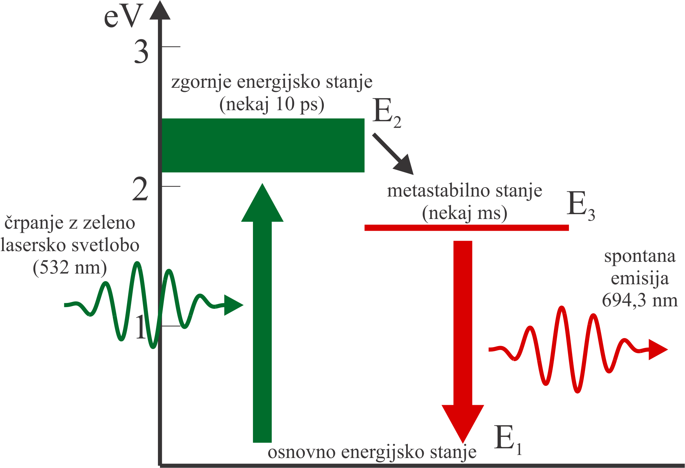
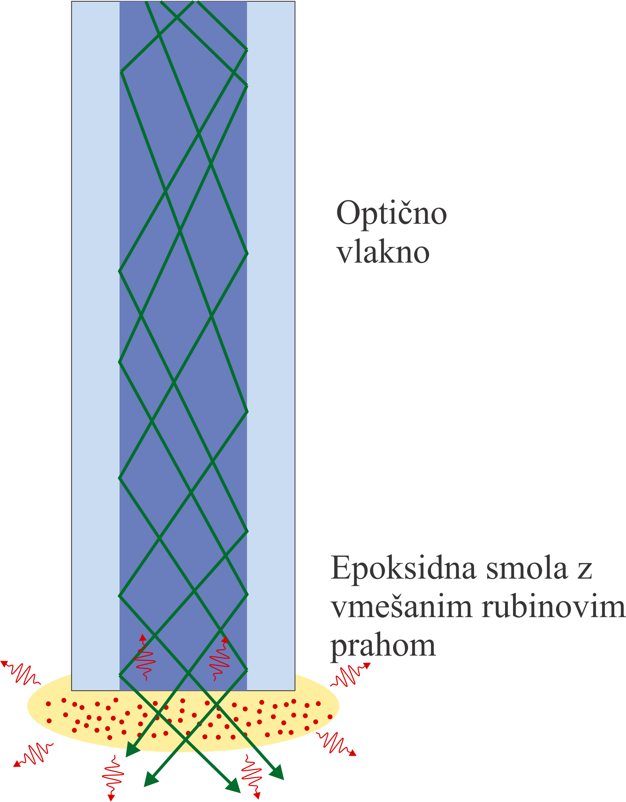

.. _vlakenski_senzorji:

Vlakenski senzorji
--------------------------------

.. |theta_c| replace:: :math:`{\Theta_C}`
.. |theta_na| replace:: :math:`{\Theta_{NA}}`
.. |I_0| replace:: :math:`{I_{0}}`

Uvod
^^^^^^^^^^^^^

Na vaji boste spoznali dva vlakenska senzorja: *vlakenski senzor pomika* in *vlakenski fluorescentni termometer*. Spoznali boste osnovne principe delovanja, področja uporabe tovrstnih senzorjev in izvedli umeritev obeh senzorjev.

Vlakenski senzor pomika
^^^^^^^^^^^^^^^^^^^^^^^^^^^^^^^^^^^^^^^^^^^

Principe delovanja optičnih vlaken ste že spoznali. Osnovni pojav je totalni odboj, ki se vrši na meji med jedrom in plaščem vlakna, kadar je vpadni kot žarka glede na normalo meje dovolj velik; večji od mejnega kota |theta_c|.

Če je vlakno ravno, moramo tako le zagotoviti, da žarek v vlakno uvedemo pod kotom, ki je manjši od |theta_na| in vsa uvedena svetloba bo izšla tudi iz vlakna. Mejni vstopni kot |theta_na| izračunamo kot:

.. math::
   NA = sin \theta_{NA} = \frac{1}{n_0} \sqrt{n_J ² - n_P ²}

kjer je *NA* numerična odprtina vlakna, *n*\ :sub:`0`\, *n*\  :sub:`J`\ in *n*\ :sub:`P`\  pa so lomni količniki *okolice*, *jedra* in *plašča*.

Če optično vlakno ukrivimo lahko ugotovimo, da intenziteta izstopne svetlobe pade. Zakaj? Na ukrivljenem delu se v tem primeru meja med jedrom in plaščem nagnjena glede na žarek in tako je za del žarkov vpadni kot zmanjšan. Žarki, za katere se vpadni kot zmanjša pod dopustno mejo (|theta_c|), iz vlakna izidejo in na pridejo do konca vlakna (*slika 1*).

   
   Slika 1. Na levi strani je skica pogojev, ki nastopijo pri krivljenju vlakna za premajhen radij, na desni strani pa ukrivljenost še omogoča vodenje žarka.

Omenjeni pojav je običajno neželen, saj nas omejuje v možnostih, kako lahko vlakno položimo. A pojav lahko tudi izkoristimo v naš prid. Shema sistema za merjenje pomika na osnovi ocenjevanja zmanjševanja izhodne intenzitete je vidna na *sliki 2*. Svetlobo od laserskega vira vodimo po optičnem vlaknu do fotodiode, ki meri količino vpadle svetlobe. S pomočjo sistema »grabljic« v osrednjem delu vlakno krivimo. Pri tem so spodnje grabljice nepremične, zgornje pa lahko primikamo ali odmikamo in tako spreminjamo ukrivljenost vlakna. Bolj ko bodo »grabljice« primaknjene, bolj bo vlakno ukrivljeno in manjša bo inteziteta na diodo vpadle svetlobe.

   
   Slika 2. Sistem "grabljic".

Vlakenski fluorescentni termometer
^^^^^^^^^^^^^^^^^^^^^^^^^^^^^^^^^^^^^^^^^^^^^^

**Fluorescenca** imenujemo pojav, ko snov odda svetlobo po tem, ko je predhodno svetlobo ali drugo elektromagnetno valovanje absorbirala. Pojav se široko izkorišča; predstavljajte si le fluorescentne premaze na naprimer urah in fluorescentna svetila.
Eden izmed materialov, ki fluorescira, je kristal rubina (aluminijev oksid dupiran s kromovimi ioni, *Al*\ :sub:`2`\ *O*\ :sub:`3`\ *Cr*). Prav ta kristal je bil uporabljen tudi v prvem delujočem laserskem viru (*T. H. Maiman, 1960*). Gre za tronivojski sistem, ki je prikazan na *sliki 3*.

   
   Slika 3. Energijski nivoji rubinovega laserja.

Atomi v kristalu se običajno nahajajo v osnovnem energijskem stanju *E1*. Če ga obsevamo z zeleno svetlobo valovne dolžine približno *532 nm*, bodo atomi začeli prehajati v energijsko stanje *E2*, kjer pa lahko obstanejo le kratek čas (nekaj *10 ps*). Hitro bodo prešli v metastabilno stanje *E3*, kjer pa lahko obstanejo precej dlje, nekaj milisekund. Ob prehodu v osnovno energijsko stanje *E1* bodo energijo oddali v obliki spontane emisije – fotonov z valovno dolžino *694,3 nm*.

Kako hitro se bo zgodil prehod iz metastabilnega v osnovno stanje, opisuje razpolovni čas *τ*. Ta pa je odvisen predvsem od temperature snovi; bolj kot je snov segreta, večja je amplituda nihanja kristalne rešetke, laže odda molekula energijo drugi molekuli. Tako se bo snov še dodatno segrevala (manjši bo izkoristek), *τ* pa se bo skrajšal.

Časovni potek prehajanja molekul v osnovno stanje in oddajanja svetlobe lahko opišemo z eksponentno enačbo:

.. math::
   I(t) = I_{0} \cdot  e ^ {- \frac{t}{τ}}
   
kjer je |I_0| začetna intenziteta.

   
   Slika 4. Intenziteta oddane svetlobe v odvisnosti od časa. S povečevanjem temperature snovi se τ krajša.

Potek vaje
"""""""""""""""""""""""""""""""""""""

Za merjenje temperature boste uporabljali vlakno, ki ima na konici v epoksidno smolo vmešan fluorescentni rubinov prah (*slika 4*). Vzbujali ga bomo z zeleno lasersko svetlobo, ki jo bomo vodili po vlaknu. Ta bo vzbudila rubinov prah, ki bo fluoresciral še nekaj milisekund po tem, ko bomo laserski vir ugasnili. Del oddane svetlobe rubina bo potoval po vlaknu proti fotodiodi.

   
   Slika 5. Skica vlakenskega senzorja za merjenje temperature.